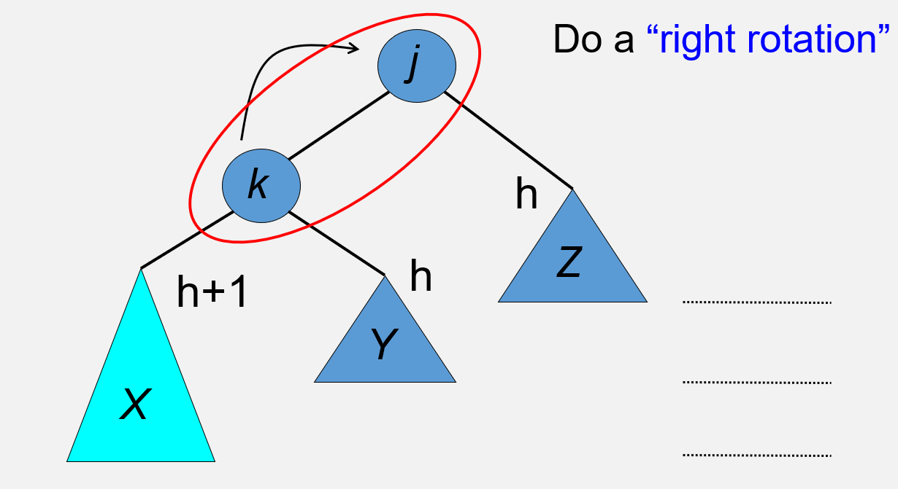
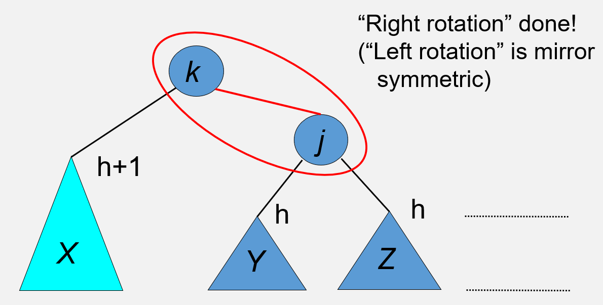
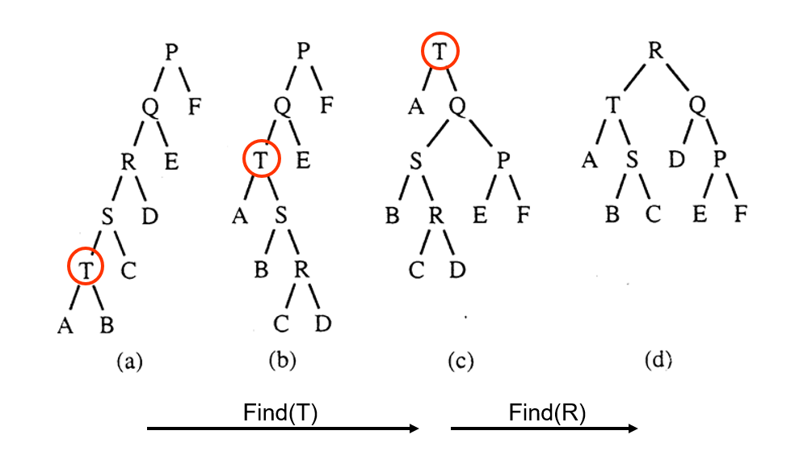

# 数据结构考试复习

by [_mingqian_233_](https://github.com/mingqian-233)

该笔记根据向毅老师的 PPT、复习课、复习提纲以及 21-23 年往年题回忆版整理。
部分概念由 gemini 生成，经本人校对。
模板题题源力扣，均已验证能够通过。代码大部分为手写，部分经过 gemini 进行注释。
**建议复习顺序：重点算法（哈希、图）- 堆 - 并查集、树 - 排序 - 剩余所有内容。**
<span style="color:red"><b>务必记住所有图论算法的具体实现！</b></span>

如果这份资料帮到了你，请 star 我，谢谢！
[github](https://github.com/mingqian-233/SCUT_SE_DataStructure)

## TODO（按 Chapter）

- [x] Chapter 1 编程概述（Programming: A General Overview）
- [x] Chapter 2 算法分析（Algorithm Analysis）
- [x] Chapter 3 列表、栈和队列（Lists, Stacks and Queues）
- [x] Chapter 4 树（Trees）
- [x] Chapter 5 散列（Hashing）
- [x] Chapter 6 优先队列（堆）（Priority Queues - Heaps）
- [x] Chapter 7 排序（Sorting）
- [x] Chapter 8 不相交集类（The Disjoint Sets Class）
- [x] Chapter 9 图算法（Graph Algorithms）

## Chapter 1 编程概述（Programming: A General Overview）

这一部分是非常非重点的非重点。

### 理解

#### 数据结构与算法的概念（Concept of Data Structure and Algorithm）

数据结构本质上是数据的管理方式，算法是一系列指令和步骤。

#### 抽象数据类型（ADT - Abstract Data Type）

- 重点在实现细节的无关性。
- 一般包含数据对象的具体形式（e.g. 整数）和操作（e.g. 插入、删除）。
- stack 就是 ADT。

### 了解

#### 数学基础（Math Preliminaries）

一定要懂数学。

### 掌握

#### 数学计算（Math Computations）

指数（Exponents），对数（Logarithms），级数（Series）等

#### 递归（Recursion）

C++应该学过这个吧，略。

---

## Chapter 2 算法分析（Algorithm Analysis）

实际上应该只要知道怎么分析时间复杂度即可。

### 理解

#### 增长率（Growth Rate）

随着数据规模 N 的增长，算法耗时的增长速度。
注意，当 N 很小的时候，算法的复杂度会受很大的常数的影响，导致$O(N)$甚至可能劣于$O(N^2)$的情况出现。

#### 典型增长率方程（Typical Growth Rate Equation）

- n!、2^n、nlogn、n²、n、logn 等

#### 上界与下界及相关规则（Upper & Lower Bounds and Relative Rules）

算法分析使用渐近符号 (Asymptotic Notation) 来描述 $T(N)$ 的增长率。

**绝大多数情况**只要求用大 O。

下面四种都可视为针对 N 无穷大的情况。

大 O (Big-Oh): $T(N) = O(f(N))$（上界），运行时间多长不会超过它。
大 Omega (Big-Omega): $T(N) = \Omega(g(N))$（下界），运行时间多短都不会小于它。
大 Theta (Big-Theta): $T(N) = \Theta(h(N))$（紧密界），上面两个恰好相同。
小 o (Little-oh): $T(N) = o(p(N))$
无论给实际时间乘上什么常数都不会超过括号里面的数字的数量级。例如：$N$ 是 $o(N^2)$ 的，因为 $N$ 严格小于 $N^2$。

#### 最佳、最坏和平均情况（Best, Worst and Average Cases）

没什么特别的，针对具体算法记忆。图论和排序似乎比较青睐这个考点。e.g. 堆排序无论什么情况复杂度都是雷打不动的$O(\log n)$。
一般时间复杂度都是看平均情况。

### 掌握

#### 渐进分析（Asymptotic Analysis）

最坏情况：
其实就是把 N 放到无穷大，看它的执行次数的数量级的**等价无穷大**的数量级。大阶吞小阶。注意不同字母的不能吞。
例如$3 \times 2^x + x + y → 2^x + y$.
循环嵌套的时候就把次数相乘。

平均情况：
求期望。

if,else,else：
取最大代价。

子程序：
将所有子程序成本相加。

递归子程序：
用递推关系表示成本。

---

## Chapter 3 列表、栈和队列（Lists, Stacks and Queues）

### 掌握

#### 线性表（Lists）

1. 数组实现和链式实现
   数组实现略。
   链式线性表就是链表，分为单链表、双链表、循环单链表、循环双链表等。插入有头插和尾插。
   删除单链表的值 val，保证链表的值两两不同：

```cpp
class Solution {
public:
    ListNode* deleteNode(ListNode* head, int val) {
        ListNode* ptr = head;
        ListNode* tmp = head;
        if (head->val != val)
            while (ptr->next != nullptr) {
                if (ptr->next->val == val) {
                    tmp = ptr->next;
                    ptr->next = ptr->next->next; // 直接把儿子丢了，孙子当儿子
                    break;
                }
                ptr = ptr->next;
            }
        else {
            head = head->next; // 删头
        }
        delete tmp; //释放内存。注意力扣的评测加这个会报错
        return head;
    }
};
```

插入是相同的。注意处理好头结点的特殊情况，以及有尾指针等情境下的情况。
**一言以蔽之，维护所有相邻结点的信息。**
多数情况下画图解决很方便。

#### 栈（Stacks）

记住先进先出的特性。只需要栈顶指针处理即可。

#### 队列（Queues）及其变体

循环队列、双向队列的作用以及实现。
数组实现的时候，判空和判满的逻辑不是打架了吗？因此必须选一个：

1. 多开一个数字记录元素数量，或者前一个操作是插入还是删除
2. 开一位冗余位。

#### 平衡点（Break-even Point）

基于数组的实现（Array-based）与基于链表的实现（Linked List）在存储空间消耗上相等的那个临界点。

如果你预计列表大部分时间是满的或接近满的，数组通常更优。

如果你预计列表大部分时间是空的或者元素数量波动极大，链表通常更优。

---

## Chapter 4 树（Trees）

### 理解

#### 树的定义和性质（Definition and Properties of Tree）

略

#### 二叉树（Binary Tree）

略

#### 完全二叉树（Complete Binary Trees）

在当前层数的前提下，所有层（除了最后一层）全都是满的，而且最后一层是从左到右依次填充的。

#### 满二叉树（Full Binary Trees）

在当前层数的前提下，一个结点都塞不下了。

#### 平衡树（Balance Trees）

让每一块的高度尽量平衡，看起来不偏不倚。任何节点的左子树和右子树的高度差，都严格控制在一定范围内（通常是 1 或倍数关系）。
例如普通的二叉搜索树就是非平衡树，1-2-3-4-5 插入后退化为链表。
注意，伸展树形态并不平衡，然而效率是接近平衡的。

#### 2-3 树（2-3 Trees）

特殊节点 3 结点，里面可以存 2 个数字，划分出 3 个区间，分别为左中右儿子。
如果一个结点塞了 3 个数字，它就裂开了。中间那个点恰好可以放到上一层做爸爸，左右结点做儿子，和一般的 BST 的父子是一样的形态。
如果上一层也是满的，就会继续裂开。

#### B 树（B-trees）

2-3 树的扩容版，每个结点可以放 M 个数字，有 M-1 个孩子。
也可以裂开。正中间的键会被往上提。
选择 M：通常选择 M 使得一个节点的大小等于一个磁盘块的大小（例如 32 到 256）。

### 了解

#### 摊销分析（Amortized Analysis）

### 掌握

#### 二叉树遍历（Binary Tree Traversals）

- 前序（Preorder）
- 后序（Postorder）
- 中序（Inorder）

根 左 右。这三种的区别就在于“根”在前、中还是后。
[中序遍历](https://leetcode.cn/problems/binary-tree-inorder-traversal/description/?envType=problem-list-v2&envId=binary-tree)

```cpp
/**
 * Definition for a binary tree node.
 * struct TreeNode {
 *     int val;
 *     TreeNode *left;
 *     TreeNode *right;
 *     TreeNode() : val(0), left(nullptr), right(nullptr) {}
 *     TreeNode(int x) : val(x), left(nullptr), right(nullptr) {}
 *     TreeNode(int x, TreeNode *left, TreeNode *right) : val(x), left(left),
 * right(right) {}
 * };
 */
class Solution {
public:
    vector<int> result;
    void dfs(TreeNode*& cur) {
        if(cur->left!=nullptr)dfs(cur->left);
        result.push_back(cur->val);
        if(cur->right!=nullptr)dfs(cur->right);
    }
    vector<int> inorderTraversal(TreeNode* root) {
        if(root!=nullptr)dfs(root);
        return result;
    }
};
```

#### 二叉树的实现及其空间需求（Implementations and Their Space Requirements）

上面已经有了。空间需求是$O(n)$。

#### 二叉搜索树（BST - Binary Search Tree）

1. **注意 BST 的插入方式决定了它的性质是左边的子树全都严格小于该结点，右是全都严格大于。不存在左儿子的右儿子比它本身大的情况。**
2. BST 的中序遍历是一个递增的有序序列。这是一个充要条件。

- 构造
- 搜索
- 插入
- 删除
- 算法复杂度

上述都是利用 BST 的性质做。简而言之，要找的数字比当前小就往左走，比当前大就往右走。
复杂度，平均情况下，查找、插入、删除的时间复杂度为：$O(\log N)$。当退化为链表的时候，也就得到了最坏复杂度$O(N)$。

#### AVL 树（AVL Trees）

- AVL 性质
  自己会平衡自己的二叉树。
  每一次操作都要检验左子树和右子树的高度差的绝对值是否超过 1 了（用平衡因子 BF 表示，BF=L-R，强制 BF 的绝对值不超过 1），所以它的高度的数量级必定是 $O(\log N)$，所有 操作的复杂度也是$O(\log N)$。

- 重新平衡操作（Re-balancing Operations）
  口诀：**同反异同**
  在 X 子树的 Y 侧插入导致不平衡——如果 X 和 Y 相同就对不平衡结点执行**一次**与 X 方向相反的操作，如果相异，就先对**子树**执行一次 X 旋转，**再**对不平衡结点进行一次 Y 旋转。
  注意有时候旋转的时候会转出一个孤立点没地方连。
  
  把 k 旋转上去之后，它就有仨儿子了，明显不好。那就让 Y 断绝关系，把它扔给 j 当做儿子。
  

注意这个操作没有展示出来的一个复杂的点：j 为其他人的儿子的时候，你得让 j 先和他断绝关系，然后再把 k 塞给他当儿子。这个实际操作里面容易遗漏。

#### 伸展树（Splay Trees）

- 伸展性质
  前提：“刚被访问的节点很可能很快再次被访问”的假设
  调整：每次访问节点（包括查找、插入），都会触发伸展操作，将该节点移动到根节点的位置。这使得频繁访问的节点能够被快速找到。
  均摊复杂度：虽然单次操作的最坏时间复杂度可能为 $O(N)$（例如树退化为链表时），但一系列 $M$ 次操作的总时间复杂度保证为 $O(M \log N)$。因此，单次操作的均摊时间复杂度为 $O(\log N)$。
- 伸展操作（Splaying Operations）
  实际上只有一个核心：**干罢爹** _（指通过旋转让自己爸爸干掉自己爸爸的爸爸或者自己干掉爸爸，最终成为祖宗）_
  从自己出发，往上走两步：
  - 如果方向是相同的，就**让爸爸干掉爷爷**，自己再干掉爸爸！
  - 如果方向是不同的，就**自己连续干掉两次**爸爸！（相当于干到爷爷那里）
  - 如果只剩下爸爸了（爸爸就是根节点），直接干掉爸爸就好！

（旋转的方式和 avl 一样，怎么能让目标结点上去干掉爸爸就怎么旋转）

建议对着这个图练习：


删除：把那个要删的点转成祖宗。拿掉它，让左边的最大的结点重新成为根节点（直接替代）。

#### 上述所有树的实现（Implementations of All Above Trees）

略。多画画图，注意处理好爷孙关系（旋转爸爸的时候要让爷爷重新认亲）即可。

---

## Chapter 5 散列（Hashing）

### 理解

#### 查找的概念（Concepts of Searching）

略

### 掌握

#### 二分查找（Binary Search）

_为啥二分查找会出现在这里？_

其实很重要的是边界条件的判断，这个太抽象了，所以最好还是记住模板。其中 `l < r` 的时候要特判。因为最终如果 `l==r` 的话，它并不会进入循环，这样就少了这种情况的判断。
但是如果代码填空中规定了初始值，例如`l=-1`之类的，那运气很不好了，只能自己列个总共奇数个的序列，再列总共偶数个的序列，特值法试试吧。

`l <= r`版本：

```cpp
class Solution {
public:
    int search(vector<int>& nums, int target) {
        int l=0,r=nums.size()-1;
        while(l<=r){
            int mid=(l+r)/2;
            if(nums[mid]==target)return mid;
            if(nums[mid]<target)l=mid+1;
            else r=mid-1;
        }
        return -1;
    }
};
```

`l < r `版本（类似`l+1!=r`）：
这种版本更加适用于找到“第一个大于等于 target 的数”，即一直缩到 `l==r` 锁定答案。

```cpp
class Solution {
public:
    int search(vector<int>& nums, int target) {
        int l=0,r=nums.size()-1;
        while(l<r){
            int mid=(l+r)/2;
            if(nums[mid]==target)return mid;
            if(nums[mid]<target)l=mid+1;
            else r=mid;
        }
        if(l==r)return target==nums[l]?l:-1;
        return -1;
    }
};
```

#### 散列表（Hash Table）

就是把一个区间范围特别大，但是值少的集合，映射到一个区间范围更小的集合。
分离链接法的时间复杂度为$O(1) + O(\lambda)$，$\lambda$为负载系数。

#### 典型散列函数（Typical Hash Functions）

要求掌握的其实只有 Mod Hash Function。

#### 冲突与冲突解决策略（Collision and Collision Resolution Policy）

- 分离链接法（Separate Chaining）
- 开放寻址法（Open-Addressing）

#### 典型探测函数（Typical Probe Functions）

- 线性探测（Linear Probing）
- 伪随机探测（Pseudo Random Probing）这个应该不重要
- 平方探测（Quadratic Probing）
- 双散列（Double Hashing）

注意，上述的每一种方法，在某一状态计算 HashTable 中空位的被插入的概率是不一样的。需要对已占用位置观察会跳到哪个空位，再加上本身会落到它们自己身上的概率。

具体实现见 **重点算法手写**。

---

## Chapter 6 优先队列（堆）（Priority Queues - Heaps）

### 理解

#### 优先队列的概念（Concepts of Priority Queues）

和队列差不多，但是有自动插队原则。对 C++，`priority_queue<int,vector<int>,greater<int>>`是小顶堆，小的数字会往前插；默认为大顶堆`less<int>`，大的数字会往前插。

#### 完全二叉树（Complete Binary Tree）

上面有解释过。堆就是一种完全二叉树。
这个二叉树和 BST 可完全不一样。例如大顶堆，是保证它的后代全部小于它，而不是“左小右大”。

### 掌握

#### 二叉堆（Binary Heaps）

注意一个重要的点：**用来建堆的数组，`index=0`处是不使用的。**

- 插入操作（Insertion）
  想象一个公司（堆），新员工（新数字）入职了。
  入座： 他先坐在公司最后的一个空位上（二叉树的最后一个位置）。
  挑战上司（上浮 / Swim）： 他看看他的直属上司（父节点）。
  如果他比上司大（能力强），他就跟上司交换位置。
  换完位置，他再看新的上司，如果还比上司大，继续换。
  直到他遇到一个比他厉害的上司，或者坐到了董事长的位置（根节点），才停下来。

- 删除操作（Delete）
  临时顶替： 我们不能让位置空着，也不能从中间拔一个人。我们就把公司里最不起眼、最后进来的那个小员工（二叉树最后一个节点）直接拎到董事长的位置上。
  认清现实（下沉 / Sink）： 这个小员工坐在高位，瑟瑟发抖。他看看左边的下属，再看看右边的下属。
  如果下属里有比他大的，他就挑那个最大的下属，跟自己交换位置。
  换下来后，继续看新下属，如果还比不过，继续换。
  直到他比下属都大，或者沉到了最底层。

- 建堆操作（BuildHeap Operations）
  这个可不是像 BST 一样一个个插。
  我们随便把所有人都赶进公司，找到最后一个有下属的人，看看自己是不是德不配位，如果是的话，就让它降职把下属换上来。
  从后往前搞，每一个点都搞一遍。一直搞到董事长（根节点）为止。
  **复杂度$O(N)$，明显优于逐个插入。**

- 算法复杂度（Algorithm Complexity）
  一次操作是$O(\log N)$.

[第 k 大元素](https://leetcode.cn/problems/kth-largest-element-in-an-array/)

```cpp
class Solution {
public:
    // 维护一个大顶堆，弹出k-1个元素即可
    void up(int ind, auto& a) {
        int faind = ind / 2;
        if (a[ind] > a[faind]) {
            swap(a[ind], a[faind]);
            up(ind / 2, a);
        }
    }
    void down(int ind, auto& a) {
        int n = a.size();
        while (ind * 2 < n) {
            int left = ind * 2;
            int right = ind * 2 + 1;
            int largest = left;
            if (right < n && a[right] > a[left]) {
                largest = right;
            }
            if (a[largest] > a[ind]) {
                swap(a[ind], a[largest]);
                ind = largest;
            } else
                break;
        }
    }
    void pop(auto& a) {
        swap(a[1], a[a.size() - 1]);
        a.erase(a.end() - 1);
        down(1, a);
    }
    void buildHeap(int ind, auto& a) {
        while (ind != 0) {
            down(ind, a);
            cout << "ind=" << ind << " a[]=" << a[ind] << '\n';
            ind --;
        }
    }
    int findKthLargest(vector<int>& nums, int k) {
        nums.insert(nums.begin(), -2100000000);// 插入一个哨兵值
        buildHeap(nums.size() - 1, nums);
        k--;
        while (k--) {
            cout << nums[1];
            pop(nums);
        }
        return nums[1];
    }
};
```

---

## Chapter 7 排序（Sorting）

### 理解

#### 内部排序与外部排序（Internal Sorting and External Sorting）

- **内部排序 (Internal Sorting)**：
  - 定义：待排序的所有记录都能同时放入计算机的内存（Memory）中进行处理。
- **外部排序 (External Sorting)**：
  - 定义：待排序的数据量太大，无法一次性装入内存，需要将数据存储在外部存储器（如磁盘、磁带）中。
  - 特点：处理过程涉及内存与外存之间的数据传输（读取和写入），主要目标是最小化读写外存的次数（I/O 次数）。

#### 排序的一般下界（A General Lower Bound for Sorting）

- **结论**：基于**比较**（Comparison-based）的排序算法，其最坏情况下的时间复杂度下界是 Ω(N log N)。
- **决策树模型 (Decision Tree)**：
  - 任何基于比较的排序算法都可以用决策树来建模。
  - 决策树是二叉树，每个节点代表一次比较（Yes/No）。
  - 叶子节点代表一种可能的排列（Permutation）。对于 N 个不同的元素，共有 N! 种排列，因此树至少有 N! 个叶子节点。
  - 树的深度（Depth）对应算法在最坏情况下的比较次数。
  - 根据二叉树性质，深度 d ≥ log(N!) ≈ N log N。

### 掌握

预测会出补全代码或者模拟实现的题目。但是背下来这么多份代码必定是不现实的，所以记忆一下原理到时候随机应变。

#### 所有学过的排序算法

##### 1. 冒泡排序 (Bubble Sort)

- **思想**：通过相邻元素的比较和交换，将最大的元素像“气泡”一样逐渐“浮”到数组的末尾（正确位置）。
- **性质**：
  - 稳定性：稳定 (Stable)。
  - 空间：原地排序 (In-place)，O(1) 额外空间。
- **过程**：
  - 进行 N-1 趟冒泡。
  - 第 i 趟从头开始比较相邻元素，若 A[j] > A[j+1] 则交换，直到将当前最大的元素移动到位置 N-i。
- **实现**：双重循环，内层循环比较并交换相邻元素。
- **复杂度**：
  - 最坏/平均/最好时间：Θ(N^2)（比较次数始终约为 N^2/2）。
  - 交换次数：平均 O(N^2)，最好 0。

##### 2. 选择排序 (Selection Sort)

- **思想**：第 i 趟遍历从未排序部分选出最小的元素，将其与第 i 个位置的元素交换。
- **性质**：
  - 稳定性：不稳定 (Not Stable)。
  - 空间：原地排序 (In-place)。
- **过程**：
  - 从 i=0 到 N-2，在 A[i...N-1] 中找到最小值的下标 `lowindex`。
  - 交换 A[i] 和 A[lowindex]。
- **实现**：双重循环，内层循环只找最小值下标，外层循环结束时才交换一次。
- **复杂度**：
  - 时间：Θ(N^2)（无论最好最坏，比较次数固定）。
  - 交换次数：N-1 次（最少），优于冒泡排序。

##### 3. 插入排序 (Insertion Sort)

- **思想**：将当前元素插入到前面已经排好序的序列中的正确位置。
- **性质**：
  - 稳定性：稳定 (Stable)。
  - 空间：原地排序 (In-place)。
  - 特点：对于**几乎有序**（Almost sorted）的数据非常高效，接近 O(N)。
- **过程**：
  - 从 i=1 开始，将 A[i] 与 A[i-1], A[i-2]... 比较。
  - 如果 A[i] 小于前者，则交换（或后移），直到找到合适位置。
- **实现**：双重循环，内层循环条件为 `j>0 && A[j] < A[j-1]`。
- **复杂度**：
  - 最坏时间（逆序）：Θ(N^2)。
  - 最好时间（有序）：Θ(N)。
  - 平均时间：Θ(N^2)（取决于逆序对的数量，平均为 N^2/4）。

##### 4. 希尔排序 (Shellsort)

- **思想**：缩小增量排序（Diminishing Increment Sort）。先将数组按间隔 h_k 分组进行插入排序，使数组“基本有序”，最后进行一次普通的插入排序（间隔为 1）。
- **性质**：
  - 稳定性：不稳定 (Not Stable)。
  - 空间：原地排序 (In-place)。
- **过程**：
  - 选择增量序列 h*t, h*{t-1}, ..., 1。
  - 对每个增量 h_k，对相隔 h_k 的元素序列执行插入排序。
- **实现**：三重循环（最外层遍历增量，中间层遍历子序列，最内层为插入排序）。
- **复杂度**：
  - 依赖于增量序列的选择。
  - Shell 增量 (N/2, N/4...)：最坏 Θ(N^2)。
  - Hibbard 增量 (1, 3, 7... 2^k-1)：最坏 Θ(N^{3/2})。
  - Sedgewick 增量：最坏 O(N^{4/3})，平均 O(N^{7/6})。

##### 5. 堆排序 (Heapsort)

- **思想**：利用最大堆（Max-Heap）特性。先建堆，然后重复执行 N 次“删除最大值”操作，将堆顶（最大值）交换到数组末尾。
- 可以解决的问题包括找前 k 个最大元素，建堆大小为 k 即可，复杂度为$O(N \log K)$。
- **性质**：
  - 稳定性：不稳定 (Not Stable)。
  - 空间：原地排序 (In-place)。
- **过程**：
  - 1. BuildHeap: 将数组调整为最大堆 (O(N))。
  - 2. 循环 N 次：将堆顶 A[1] 与堆尾元素交换，堆大小减 1，然后 PercolateDown 恢复堆序。
- **实现**：使用数组模拟堆，父子节点索引关系（i 的孩子是 2i, 2i+1）。
- **复杂度**：
  - 时间：Θ(N log N)（最好、最坏、平均均为 O(N log N)）。

##### 6. 归并排序 (Mergesort)

- **思想**：分治法 (Divide and Conquer)。将数组从中点切分为两半，递归排序每一半，最后将两个有序子数组**合并** (Merge)。
- **性质**：
  - 稳定性：稳定 (Stable)。
  - 空间：非原地 (Not In-place)，需要 O(N) 的辅助数组 temp。
- **过程**：
  - Mergesort(left, right): 计算 mid，递归调用 Mergesort(left, mid) 和 Mergesort(mid+1, right)。
  - Merge: 比较两个子数组的头部元素，较小的放入辅助数组，最后考回原数组。
- **实现**：通常使用递归实现，也可使用迭代。
- **复杂度**：
  - 时间：Θ(N log N)（所有情况）。
  - 递推公式：T(N) = 2T(N/2) + O(N)。

##### 7. 快速排序 (Quicksort)

- **思想**：分治法。选定一个**枢纽元 (Pivot)**，将数组**划分 (Partition)** 为两部分：左边小于 Pivot，右边大于 Pivot，然后递归排序这两部分。
- **性质**：
  - 稳定性：不稳定 (Not Stable)。
  - 空间：原地排序 (In-place)，但递归调用需要 O(log N) 的栈空间。
- **过程**：
  - 1. 选 Pivot（如“三数中值分割法” Median-of-Three）。
  - 2. Partition：双指针 i, j 向中间扫描，交换不符合大小关系的元素，直到相遇。
  - 3. 递归处理左右子数组。
- **实现**：核心是 partition 函数。小数组（如 N ≤ 10）时可优化为切换到插入排序。
- **复杂度**：
  - 平均时间：O(N log N)。
  - 最坏时间：O(N^2)（Pivot 选得极差）。

##### 8. 桶排序 (Bucket Sort)

- **思想**：将键值映射到桶（Bucket）的索引上。适用于键值范围有限且为整数的情况。
- **过程**：
  - 创建 M 个桶（M 为键值范围）。
  - 遍历数组，将 A[i] 放入 B[A[i]]。
  - 按顺序收集桶中元素。
- **复杂度**：
  - 时间：Θ(N + M)。

##### 9. 基数排序 (Radix Sort)

- **思想**：多趟桶排序。按键值的“位”（Digit）进行排序，通常从低位到高位（LSD）。
- **性质**：
  - 稳定性：稳定 (Stable)。
  - 空间：非原地，需要辅助桶空间。
- **过程**：
  - 设进制为 b，进行 r 趟分配和收集。
  - 第 i 趟根据第 i 位数值将元素分配到 b 个桶中，再按桶顺序收集回数组。
- **复杂度**：
  - 时间：Θ(r(N + b))，其中 r = log_b(MaxVal)。

##### 10. 外部归并排序 (External Mergesort)

- **思想**：处理无法全部装入内存的大规模数据。利用归并排序的思想，先生成初始顺串（Runs），再进行多路归并。
- **过程**：
  - Run 构造阶段：读取内存能容纳的数据量 M，内部排序后写回磁盘。
  - 归并阶段：使用 k 路归并（k-way merge），将 k 个 Runs 合并为一个更长的 Run，直到剩下一个文件。
- **复杂度**：
  - 总遍数 (Passes) = 1 + ceil(log_k(Runs))。
- **置换选择排序 (Replacement Selection)**：
  - 用于生成更长的初始 Run（平均长度 2M），利用最小堆实现。

#### 演示

**演示序列：** `[ 34, 8, 64, 51, 32, 21 ]`
**目标状态：** `[ 8, 21, 32, 34, 51, 64 ]`

---

1. 冒泡排序 (Bubble Sort)**逻辑**：两两比较，大的往后“冒泡”。

- **初始**：`[ 34, 8, 64, 51, 32, 21 ]`
- **第 1 趟**：
- 34>8，交换 -> `[ 8, 34, ... ]`
- 34<64，不换 -> `[ 8, 34, 64, ... ]`
- 64>51，交换 -> `[ ..., 51, 64, ... ]`
- 64>32，交换 -> `[ ..., 32, 64, ... ]`
- 64>21，交换 -> `[ ..., 21, 64 ]` (最大值 64 到位)
- **结果**：`[ 8, 34, 51, 32, 21, **64** ]`

- **第 2 趟**：
- 对比到倒数第二个。51>32 换，51>21 换。
- **结果**：`[ 8, 34, 32, 21, **51**, 64 ]`

- **第 3 趟**：
- 34>32 换，34>21 换。
- **结果**：`[ 8, 32, 21, **34**, 51, 64 ]`

- **第 4 趟**：
- 32>21 换。
- **结果**：`[ 8, 21, **32**, 34, 51, 64 ]`

- **第 5 趟**：
- 8<21，不换。
- **最终**：`[ 8, 21, 32, 34, 51, 64 ]`

---

2. 选择排序 (Selection Sort)**逻辑**：每次在未排序部分找到**最小**值，放到未排序部分的起始位置。

- **初始**：`[ 34, 8, 64, 51, 32, 21 ]`
- **第 1 趟**：
- 在 `[34 ... 21]` 中找最小，是 8。
- 交换 8 和第一个元素 34。
- **结果**：`[ **8**, 34, 64, 51, 32, 21 ]` (8 已排好)

- **第 2 趟**：
- 在 `[34 ... 21]` 中找最小，是 21。
- 交换 21 和 34。
- **结果**：`[ 8, **21**, 64, 51, 32, 34 ]`

- **第 3 趟**：
- 在 `[64 ... 34]` 中找最小，是 32。
- 交换 32 和 64。
- **结果**：`[ 8, 21, **32**, 51, 64, 34 ]`

- **后续**：
- 找到 34 换到 51 位置 -> `[ 8, 21, 32, **34**, 64, 51 ]`
- 找到 51 换到 64 位置 -> `[ 8, 21, 32, 34, **51**, **64** ]`

---

3. 插入排序 (Insertion Sort)**逻辑**：像摸扑克牌一样，抓一张新牌，插入到手牌（已排序区）的正确位置。

- **初始**：`[ 34, 8, 64, 51, 32, 21 ]` (默认 34 是一张已抓的牌)
- **插入 8**：
- 8 < 34，34 后移，8 放前面。
- **结果**：`[ **8, 34**, 64, 51, 32, 21 ]`

- **插入 64**：
- 64 > 34，不动。
- **结果**：`[ 8, 34, **64**, 51, 32, 21 ]`

- **插入 51**：
- 51 < 64 (64 后移)，51 > 34 (停下)。
- **结果**：`[ 8, 34, **51, 64**, 32, 21 ]`

- **插入 32**：
- 比 64 小，比 51 小，比 34 小，比 8 大。
- **结果**：`[ 8, **32**, 34, 51, 64, 21 ]`

- **插入 21**：
- 一路比下去，插在 8 和 32 之间。
- **结果**：`[ 8, **21**, 32, 34, 51, 64 ]`

---

4. 希尔排序 (Shellsort)**逻辑**：分组插入。设增量序列为 N/2 (即 Gap=3)，然后 Gap=1。

- **初始**：`[ 34, 8, 64, 51, 32, 21 ]`
- **Gap = 3**：
- 将数组分为三组：

1. `[34, 51]` (索引 0, 3) -> 有序，不变。
2. `[8, 32]` (索引 1, 4) -> 有序，不变。
3. `[64, 21]` (索引 2, 5) -> **逆序，交换**。

- **结果**：`[ 34, 8, **21**, 51, 32, **64** ]` (此时数组“基本有序”)

- **Gap = 1** (普通插入排序)：
- 对 `[ 34, 8, 21, 51, 32, 64 ]` 进行插入排序。
- 8 插到 34 前 -> `[8, 34...]`
- 21 插到 34 前 -> `[8, 21, 34...]`
- 51 不动。
- 32 插到 34 前 -> `[8, 21, 32, 34, 51, 64]`
- 64 不动。
- **最终**：`[ 8, 21, 32, 34, 51, 64 ]`

---

5. 堆排序 (Heapsort)**逻辑**：建最大堆 -> 堆顶(最大)换到最后 -> 堆减小，下滤(Percolate Down)。

- **初始**：`[ 34, 8, 64, 51, 32, 21 ]`
- **阶段 1：建堆 (BuildHeap)**
- 从最后一个父节点开始调整。最后结果是最大堆：`[ 64, 51, 34, 8, 32, 21 ]`
- (注：64 在堆顶，是最大值)

- **阶段 2：删除最大值 (DeleteMax)**
- **Swap 1**: 堆顶 64 与末尾 21 交换。数组：`[ 21, 51, 34, 8, 32 | **64** ]`。调整堆（21 下沉）。
- 堆状态：`[ 51, 32, 34, 8, 21 ]`
- **Swap 2**: 堆顶 51 与末尾 21 交换。数组：`[ 21, 32, 34, 8 | **51, 64** ]`。调整堆。
- 堆状态：`[ 34, 32, 21, 8 ]`
- **Swap 3**: 堆顶 34 与末尾 8 交换。数组：`[ 8, 32, 21 | **34, 51, 64** ]`。调整堆。
- 堆状态：`[ 32, 8, 21 ]`
- ...以此类推，直到堆为空。
- **最终**：`[ 8, 21, 32, 34, 51, 64 ]`

---

6. 归并排序 (Mergesort)**逻辑**：分治 (Split) + 合并 (Merge)。

- **Split**:
- `[ 34, 8, 64 ]` 和 `[ 51, 32, 21 ]`
- 继续拆分直到单个元素。

- **Merge 过程** (自底向上):

1. `[34]` 与 `[8]` 合并 -> `[8, 34]`. `[64]` 保持.
2. `[8, 34]` 与 `[64]` 合并 -> **左半边有序**：`[ 8, 34, 64 ]`
3. `[51]` 与 `[32]` 合并 -> `[32, 51]`. `[21]` 保持.
4. `[32, 51]` 与 `[21]` 合并 -> **右半边有序**：`[ 21, 32, 51 ]`
5. **最后合并** 左 `[8, 34, 64]` 和 右 `[21, 32, 51]`:

- 比头：8<21 (取 8)
- 比头：21<34 (取 21)
- 比头：32<34 (取 32)
- 比头：34<51 (取 34)
- ...

- **最终**：`[ 8, 21, 32, 34, 51, 64 ]`

---

7. 快速排序 (Quicksort)**逻辑**：选 Pivot，划分 (Partition) 使左边小、右边大，递归。

- **初始**：`[ 34, 8, 64, 51, 32, 21 ]`
- **第 1 轮**：
- 选 Pivot：假设选第一个元素 **34**。
- **Partition**:
- 左指针找 >34 的，右指针找 <34 的。
- 找到 64 (左) 和 21 (右)，**交换** -> `[ 34, 8, **21**, 51, 32, **64** ]`
- 继续走，找到 51 (左) 和 32 (右)，**交换** -> `[ 34, 8, 21, **32**, **51**, 64 ]`
- 指针相遇，将 Pivot (34) 放到中间正确位置。

- **结果**：`[ 32, 8, 21 ]` **34** `[ 51, 64 ]`
- (此时 34 已经归位，左边都比它小，右边都比它大)

- **递归**：
- 对左边 `[32, 8, 21]` 排序 -> `[8, 21, 32]`
- 对右边 `[51, 64]` 排序 -> `[51, 64]`
- **最终**：`[ 8, 21, 32, 34, 51, 64 ]`

---

8. 基数排序 (Radix Sort) - LSD**逻辑**：按位入桶 (Bucket)，从低位到高位。

- **初始**：`[ 34, 08, 64, 51, 32, 21 ]` (补齐位数)
- **Pass 1 (个位)**：
- 入桶：
- 桶 1: `51, 21`
- 桶 2: `32`
- 桶 4: `34, 64`
- 桶 8: `08`

- 收集 (按桶序): `[ 51, 21, 32, 34, 64, 08 ]` (注意：个位现在是有序的 1,1,2,4,4,8)

- **Pass 2 (十位)**：
- 入桶：
- 桶 0: `08`
- 桶 2: `21`
- 桶 3: `32, 34`
- 桶 5: `51`
- 桶 6: `64`

- 收集: `[ 08, 21, 32, 34, 51, 64 ]`

- **最终**：`[ 8, 21, 32, 34, 51, 64 ]`

---

9. 外部排序 (External Sort) - 模拟由于数据量太小，我们假设 **内存只能容纳 3 个数**。

- **初始磁盘数据**：`34, 8, 64, 51, 32, 21`
- **阶段 1：生成顺串 (Run Generation)**
- 读入前 3 个 `[34, 8, 64]` -> 内存排序 -> 写回磁盘 **Run1**: `[8, 34, 64]`
- 读入后 3 个 `[51, 32, 21]` -> 内存排序 -> 写回磁盘 **Run2**: `[21, 32, 51]`

- **阶段 2：多路归并 (Merge)**
- 内存中同时读取 Run1 的头部和 Run2 的头部。
- 比较 `8` (Run1) 和 `21` (Run2) -> 输出 `8`。
- 比较 `34` (Run1) 和 `21` (Run2) -> 输出 `21`。
- ...
- **输出文件**：`[ 8, 21, 32, 34, 51, 64 ]`

---

## Chapter 8 不相交集类（The Disjoint Sets Class）

### 理解

#### 等价类（Equivalence Class）

**概念**
在集合论中，给定一个**等价关系**（满足自反性、对称性、传递性的规则），集合中的元素会被划分成若干个不相交的子集。每一个子集就是一个等价类，其中的所有元素在某种意义上是“相等”的。
简而言之，就是**按特定规则将对象归类**。

- **例子**
  **模 3 的余数分类**：
  在整数集合中，定义关系为“除以 3 余数相同”。
- **类 [0]**：\{..., -3, 0, 3, 6, ...\} （都能被 3 整除）
- **类 [1]**：\{..., -2, 1, 4, 7, ...\} （除以 3 余 1）
- **类 [2]**：\{..., -1, 2, 5, 8, ...\} （除以 3 余 2）
  这里的 \{0, 3, 6...\} 就是一个等价类，在这个规则下，它们被视为同一类事物。

#### 动态等价问题 (The Dynamic Equivalence Problem)

**概念**

这是一个算法问题，指的是在程序运行过程中，动态地维护一组不相交的集合，并支持两种核心操作：

1. **合并（Union）**：将包含元素 a 和包含元素 b 的两个集合合并为一个等价类。
2. **查找（Find）**：确定元素 x 属于哪个集合（用于判断两个元素是否等价）。
   解决此问题的经典数据结构是**并查集（Union-Find / Disjoint Set Union）**。

- **例子**
  **计算机网络的连通性**：
  假设有 5 台离线的电脑 \{A, B, C, D, E\}。

1. **初始状态**：每台电脑都是独立的（5 个等价类）。
2. **操作（Union）**：连接网线 A-B，连接网线 B-C。此时 \{A, B, C\} 互通，成为一个等价类。
3. **查询（Find）**：询问“A 和 C 是否连通？”
4. **结果**：算法通过查找发现 A 和 C 同属一个集合，返回“是”（即使 A 和 C 没有直接相连，通过传递性也视为等价）。

### 掌握

#### 并查集算法（Union/Find Algorithm）

无论如何，合并的时候都是**把其中一个树的根变成另外一个树的根的儿子**，简单理解就是我整个家族都认你为祖宗。
所以引出了两个方面的动机：
谁合并给谁？按随意/大小/高度合并。
找祖宗很麻烦，可能退化到$O(n)$咋办？路径压缩。其中由于路径压缩会改变高度，我们不把带路径压缩的并查集叫做按高度合并，而是叫做按秩合并。

- 智能合并算法（Smart Union Algorithms）

  - 随便合并（并不智能）
    后者的家族的老祖认作前者老祖的儿子
  - 按大小合并（Union by-Size）
    我家族力量大，你得给我当儿子。
  - 按高度合并（Union by-Height）
    我家族五代同堂，你四代同堂，你得给我当儿子。

当大小/高度相同的时候，就按照随便合并来。

- 路径压缩（Path Compression）
  我去找祖宗的时候，要让我这一支系的直系亲属（爸爸、爷爷、太爷爷……）超级加辈，全都叫我的老祖宗 daddy！（贵圈真乱）

find 的具体实现如下：

```cpp
    int find(int x, auto& f) {
        if (x == f[x])
            return x;
        return f[x] = find(f[x], f);
    }
```

---

## Chapter 9 图算法（Graph Algorithms）

### 理解

#### 图的概念（Concept of Graph）

### 掌握

#### 图的两种表示方法（Two Representations of Graph）

邻接矩阵和邻接表，分别适用于稠密图和稀疏图。具体实现不做讲解。

#### 广度优先搜索（BFS - Breadth-First Search & 深度优先搜索（DFS - Depth-First Search）

最简单的遍历方法。注意开 vis 数组标志是否访问过。

**以下算法见*重点算法手写*部分**

#### 拓扑排序（Topological Sort）

不断找入度为 0 的点放到队伍里面，然后踢出来（广度优先搜索），踢出来的时候把它从图上删掉，看它连着的点是否有因为入度少了 1 而变成 0 的。
如果队列空了，但是图还有剩下的，那就是有环。

#### Dijkstra 算法（Dijkstra's Algorithm）

开一个 dis 记录过程和结果。
从起点出发，把起点的出边加入优先队列，进入 BFS。每次拿一个到达代价最小的点出来（注意优化判断`代价和当前的dis[点]的大小关系`，因为必定会有点被重复插入而滞后更新，跳过），然后做一个路径压缩，压缩成功了就把点加入优先队列。

#### Prim 算法和 Kruskal 算法（Prim and Kruskal Algorithm）

Prim 是扩张行动，可以理解为一个公司，每次从公司的势力范围按照最小代价拉人。实现用 vis 标记这个人是不是在公司里面了。堆优化可以让它$O(\log n)$找到最小代价的那个人。
Kruscal 就是一个多支线发展，最终形成一个家族产业。实现上是把边按照大小排序，从上往下扫一遍看看这个边有没有必要加进来（让两个不在同一个家庭的人相亲）。用并查集实现。

#### 最短路径问题（Shortest-Path）

注意三点：

1. 多源最短路径，稀疏场景可以用 Dijkstra，稠密场景用 Floyd 会比较好。
2. Dijkstra 无法解决负权图。
3. **无权无向图的最短路使用 BFS 实现，找到点就可以直接退出了，它一定是最短路。**

#### 连通分量问题（Connected Components Problems）

DFS 和并查集都可以解决。
注意并查集在最后确认归属的时候，用的是`find(f[i])`而不是`f[i]`。

---

## 重点算法

### 怎么回答最后一题？

（逻辑结构）由于 xxx，可以把这个关系建模为有向无权图。图的一个顶点代表一个课程，一条起点 A 到终点 B 的有向边表示 B 是依赖 A 的。
（储存结构）由于 xxx，采用邻接表来表示这个图。对于每个结点维护一个可变数组/链表，A 结点的链表中的元素表示 A 结点到达的所有结点。
（算法具体实现）使用拓扑排序/并查集/……，若……，则判断出……
（手写代码）

### 哈希

[哈希集合](https://leetcode.cn/problems/design-hashmap/description/)

变长哈希实现

```cpp

class MyHashSet {

private:
    vector<int> hash[10009];

public:
    const int MOD = 10009;
    MyHashSet() {}

    void add(int key) {
        int ind = key % MOD;
        int loc = -1; // 用来记录第一个遇到的“墓碑”(-1)的位置

        // 开启一次遍历
        for (int i = 0; i < hash[ind].size(); i++) {
            if (hash[ind][i] == key) {
                return; // 发现 key 已存在，直接收工，啥都不用做
            }
            // 如果遇到被删除的位置(-1)，且之前没记录过，就记下来备用
            if (hash[ind][i] == -1 && loc == -1) {
                loc = i;
            }
        }

        // 代码走到这里，说明 key 肯定不存在
        if (loc != -1) {
            hash[ind][loc] = key; // 废物利用：覆盖掉第一个 -1
        } else {
            hash[ind].push_back(key); // 实在没空位了，才开辟新空间
        }
    }

    void remove(int key) {
        int ind = key % MOD;
        for (int i = 0; i < hash[ind].size(); i++) {
            if (hash[ind][i] == key) {
                hash[ind][i] = -1;
                return; // 优化：找到后直接 return，别往后跑了
            }
        }
    }

    bool contains(int key) {
        int ind = key % MOD;
        for (int i = 0; i < hash[ind].size(); i++) {
            if (hash[ind][i] == key) {
                return true;
            }
        }
        return false;
    }
};
```

线性探测实现，和平方探测实现原理相同。注意一定要采用**查找值不会覆盖的值**作为初始值。

```cpp
class MyHashSet {
private:
    int hash[100009];
public:
    const int MOD = 100009;

    MyHashSet() { memset(hash, -1, sizeof hash); }

    void add(int key) {
        int ind = key % MOD;
        int insertPos = -1; // 用来记录最佳插入位置

        while (1) {
            // 1. 找到了 Key，说明已存在，直接返回
            if (hash[ind] == key) {
                return;
            }

            // 2. 遇到真正的空位 -1
            if (hash[ind] == -1) {
                if (insertPos == -1) {
                    insertPos = ind; // 之前没遇到过 -2，就插在这
                }
                break; // 确认 Key 不存在，结束寻找
            }

            // 3. 遇到墓碑 -2
            if (hash[ind] == -2) {
                // 如果这是遇到的第一个空位，记录下来
                if (insertPos == -1) {
                    insertPos = ind;
                }
                // 【关键】不能 break！必须继续往后找，防止后面还有这个 Key。这里很容易错，因为可能会插到别人的墓碑上，导致表里面有两个自己。
            }
            ind = (ind + 1) % MOD;
        }

        // 循环结束，执行插入
        hash[insertPos] = key;
    }

    void remove(int key) {
        int ind = key % MOD;
        while (1) {
            if (hash[ind] == key) {
                hash[ind] = -2; // 标记为墓碑
                return;
            }
            if (hash[ind] == -1) // 遇到 -1 说明后面肯定没了
                return;
            ind = (ind + 1) % MOD;
        }
    }

    bool contains(int key) {
        int ind = key % MOD;
        while (1) {
            if (hash[ind] == key)
                return true;
            if (hash[ind] == -1) // 遇到 -1 才能断定不存在
                return false;
            // 注意：遇到 -2 (墓碑) 时要继续往后找
            ind = (ind + 1) % MOD;
        }
        return false;
    }
};
```

平方探测实现原理相同。注意一定要采用**查找值不会覆盖的值**作为初始值。另外偏移量是基于初始的 index 的，所以要记录初始的 index。

```cpp
class MyHashSet {
private:
    int hash[100009];

public:
    const int MOD = 100009;

    MyHashSet() { memset(hash, -1, sizeof hash); }

    void add(int key) {
        // 使用 long long 防止 key 本身很大时溢出，且保证正数
        int start_ind = (key % MOD + MOD) % MOD;
        int ind = start_ind;
        int insertPos = -1;
        int offset = 1;

        // 【安全守卫】限制探测次数，防止平方探测陷入死循环
        // 如果探测了 1000 次还没结果，说明表太满或冲突太严重，实际上应该扩容
        while (offset < 1000) {
            // 1. 找到 Key，已存在
            if (hash[ind] == key) {
                return;
            }

            // 2. 遇到空位 -1
            if (hash[ind] == -1) {
                if (insertPos == -1) {
                    insertPos = ind;
                }
                break; // 确认 Key 不存在
            }

            // 3. 遇到墓碑 -2
            if (hash[ind] == -2) {
                if (insertPos == -1) {
                    insertPos = ind;
                }
                // 继续往后找，防止重复
            }

            // 【核心修正】标准的平方探测公式：Base + i^2
            // 使用 long long 防止 offset*offset 溢出 int
            ind = (start_ind + (long long)offset * offset) % MOD;
            offset++;
        }

        // 如果找到了插入位置（可能是 -1 也可以是复用 -2）
        if (insertPos != -1) {
            hash[insertPos] = key;
        }
        // 如果 insertPos 还是 -1 (极小概率，表满了)，这里就丢弃了或者需要 resize
    }

    void remove(int key) {
        int start_ind = (key % MOD + MOD) % MOD;
        int ind = start_ind;
        int offset = 1;

        while (offset < 1000) {
            if (hash[ind] == key) {
                hash[ind] = -2; // 标记墓碑
                return;
            }
            if (hash[ind] == -1) return;

            ind = (start_ind + (long long)offset * offset) % MOD;
            offset++;
        }
    }

    bool contains(int key) {
        int start_ind = (key % MOD + MOD) % MOD;
        int ind = start_ind;
        int offset = 1;

        while (offset < 1000) {
            if (hash[ind] == key) return true;
            if (hash[ind] == -1) return false;

            ind = (start_ind + (long long)offset * offset) % MOD;
            offset++;
        }
        return false;
    }
};
```

双哈希：

```cpp
class DoubleHashSet {
private:
    int hash[100009];

public:
    // MOD 为表大小，最好是素数
    const int MOD = 100009;
    // PRIME2 用于第二个哈希函数，通常取比 MOD 稍小的素数
    const int PRIME2 = 99991;

    DoubleHashSet() { memset(hash, -1, sizeof hash); }

    void add(int key) {
        // h1(key): 确定初始位置
        int start_ind = (key % MOD + MOD) % MOD;
        // h2(key): 确定步长 (step)，保证 step > 0 且 step != MOD
        // 常用公式：prime - (key % prime)。这里预设了key是负数。
        int step = PRIME2 - ((key % PRIME2 + PRIME2) % PRIME2);

        int ind = start_ind;
        int insertPos = -1;
        int count = 0;

        // 【安全守卫】限制探测次数，与参考代码风格一致
        while (count < 2000) {
            // 1. 找到 Key，已存在
            if (hash[ind] == key) {
                return;
            }

            // 2. 遇到空位 -1
            if (hash[ind] == -1) {
                if (insertPos == -1) {
                    insertPos = ind;
                }
                break; // 确认 Key 不存在
            }

            // 3. 遇到墓碑 -2
            if (hash[ind] == -2) {
                if (insertPos == -1) {
                    insertPos = ind;
                }
                // 继续往后找，防止重复
            }

            // 【核心逻辑】双哈希探测公式：index = (index + step) % MOD
            ind = (ind + step) % MOD;
            count++;
        }

        if (insertPos != -1) {
            hash[insertPos] = key;
        }
    }

    void remove(int key) {
        int start_ind = (key % MOD + MOD) % MOD;
        int step = PRIME2 - ((key % PRIME2 + PRIME2) % PRIME2);

        int ind = start_ind;
        int count = 0;

        while (count < 2000) {
            if (hash[ind] == key) {
                hash[ind] = -2; // 标记墓碑
                return;
            }
            // 遇到空位说明不存在，遇到墓碑则继续探测
            if (hash[ind] == -1) return;

            ind = (ind + step) % MOD;
            count++;
        }
    }

    bool contains(int key) {
        int start_ind = (key % MOD + MOD) % MOD;
        int step = PRIME2 - ((key % PRIME2 + PRIME2) % PRIME2);

        int ind = start_ind;
        int count = 0;

        while (count < 2000) {
            if (hash[ind] == key) return true;
            if (hash[ind] == -1) return false;

            ind = (ind + step) % MOD;
            count++;
        }
        return false;
    }
};
```

### 可变数组

链式实现。这部分可以考内存计算，也可以考补充代码，难度不大。

### 哈夫曼树

每次选择两个最小权值（即根节点的 val 最小的两个）合并成 1；并非考纲内容。

### 连通分量

并查集/深度优先搜索

[完全连通分量](https://leetcode.cn/problems/count-the-number-of-complete-components/)
完全连通分量的条件更强。连通分量去掉判断出度即可。

深搜：
注意处理存图的问题。

```cpp
class Solution {
public:
    // 使用构建好的邻接表 graph 进行 DFS
    void dfs(int node, int id, vector<vector<int>>& graph, vector<int>& belong) {
        belong[node] = id;
        for (int neighbor : graph[node]) {
            if (belong[neighbor])
                continue;
            dfs(neighbor, id, graph, belong);
        }
    }

    int countCompleteComponents(int n, vector<vector<int>>& edges) {
        // 1. 构建邻接表
        vector<vector<int>> graph(n);
        for (const auto& edge : edges) {
            graph[edge[0]].push_back(edge[1]);
            graph[edge[1]].push_back(edge[0]); // 无向图，两边都要加
        }

        int id = 1;
        vector<int> belong(n, 0);

        // 2. 遍历每个节点寻找连通分量
        for (int i = 0; i < n; i++) {
            if (!belong[i]) {
                dfs(i, id, graph, belong);
                id++;
            }
        }

        // 3. 收集每个分量的节点
        // id 从 1 开始，增加到了 id，所以大小通常需要 id
        vector<vector<int>> components(id);
        for (int i = 0; i < n; i++) {
            components[belong[i]].push_back(i);
        }

        int count = 0;
        // 4. 验证每个分量是否是完全图
        // 注意：components[0] 是空的，因为 belong 从 1 开始赋值，所以这里跳过 0
        for (int k = 1; k < id; k++) {
            auto& nodes = components[k];
            int m = nodes.size(); // 分量中的节点数
            bool isComplete = true;
            for (int node : nodes) {
                // 完全图的定义：每个点都要连接到该分量内其他所有点
                // 即度数必须等于 节点数 - 1
                if (graph[node].size() != m - 1) {
                    isComplete = false;
                    break;
                }
            }
            if (isComplete) count++;
        }

        return count;
    }
};
```

并查集：
有个地方超级坑：找图中有多少连通分量，不是看`f[x]`，而是看`find(f[x])`，即它的祖宗。

```cpp
class Solution {
public:
    int find(int x, auto& f) {
        if (x == f[x])
            return x;
        return f[x] = find(f[x], f);
    }
    int countCompleteComponents(int n, vector<vector<int>>& edges) {

        vector<int> f(n, 0), edge_num(n, 0);
        // 2. 遍历每个节点寻找连通分量
        for (int i = 0; i < n; i++)
            f[i] = i;
        for (const auto& edge : edges) {
            int x = edge[0], y = edge[1];
            edge_num[x]++, edge_num[y]++;
            int fx = find(x, f), fy = find(y, f);
            f[fx] = fy;
        }
        // 3. 收集每个分量的节点
        // id 从 1 开始，增加到了 id，所以大小通常需要 id
        int id = 0;
        vector<bool> vis(n, 0);
        vector<int> mp(n, 0);
        vector<vector<int>> components(n);
        for (int i = 0; i < n; i++) {
            int fi=find(f[i],f);//一定要加这一条！路径压缩之后才能找到这个节点的祖宗
            if (!vis[fi]) {
                vis[fi] = 1;
                mp[fi] = id;
                id++;
            }
            components[mp[fi]].push_back(i);
        }

        int count = 0;
        // 4. 验证每个分量是否是完全图
        // 注意：components[0] 是空的，因为 belong 从 1 开始赋值，所以这里跳过 0
        for (int k = 0; k < id; k++) {
            auto& nodes = components[k];
            int m = nodes.size(); // 分量中的节点数
            bool isComplete = true;
            for (int node : nodes) {
                // 完全图的定义：每个点都要连接到该分量内其他所有点
                // 即度数必须等于 节点数 - 1
                if (edge_num[node] != m - 1) {
                    isComplete = false;
                    break;
                }
            }
            if (isComplete)
                count++;
        }

        return count;
    }
};
```

### 拓扑排序判环

[经典课程表](https://leetcode.cn/problems/course-schedule/solutions/359392/ke-cheng-biao-by-leetcode-solution/)
记住疯狂找入度为 0 的点删掉，找不到了，如果还有点，就寄了；否则就成功了。

注意判环**必须**用拓扑排序。

```cpp
class Solution {
public:
    bool canFinish(int numCourses, vector<vector<int>>& prerequisites) {
        //(a,b)表示b指向a
        int mamba=0;
        queue<int> q;
        vector<int> ind(numCourses, 0);
        vector<vector<int>> adj(numCourses);
        for (const auto& edge : prerequisites) {
            int x = edge[1], y = edge[0];
            ind[y]++;
            adj[x].push_back(y);
        }
        for (int i = 0; i < numCourses; i++)
            if (ind[i] == 0)
                q.push(i);
        while (!q.empty()) {
            int x = q.front();
            q.pop();
            mamba++;//mamba out
            for(const auto &i:adj[x]){
                ind[i]--;
                if(ind[i]==0)q.push(i);
            }
        }
        if(mamba!=numCourses)return false;
        else return true;
    }
};
```

### 最短路算法

```cpp

#define pii pair<int, int>
class Solution {
public:
    const int inf = 0x7fffffff;
    int networkDelayTime(vector<vector<int>>& times, int n, int k) {
        vector<int> d(n + 1, inf);
        vector<vector<pii>> adj(n + 1);
        for (const auto& edge : times) {
            int x = edge[0], y = edge[1], z = edge[2];
            adj[x].push_back({y, z});
        }
        d[k] = 0;
        priority_queue<pii, vector<pii>, greater<pii>> q;
        q.push({0, k});
        while (!q.empty()) {
            auto t = q.top();
            q.pop();
            int cost = t.first, u = t.second;
            if (cost > d[u])
                continue; // 这句是必要的，因为必定会有重复入队的情况，不加的话就会浪费
            for (const auto& r : adj[u]) {
                int v = r.first, w = r.second;
                if (d[v] > d[u] + w) {
                    d[v] = d[u] + w;
                    q.push({d[v], v});
                }
            }
        }
        int ans = 0;
        for (int i = 1; i <= n; i++)
            ans = max(ans, d[i]);
        if (ans == inf)
            ans = -1;
        return ans;
    }
};
```

### 换乘：无权无向最短路

[居然是个困难题](https://leetcode.cn/problems/bus-routes/description/)
建模很反直觉。同一条线路中往返代价为 0，而线路之间有交集的话往返代价为 1。这个判断交集不可能暴力判断，数据量直接炸了。
建议仅掌握无权无向最短路的 BFS 实现。

```cpp
class Solution {
public:
    int numBusesToDestination(vector<vector<int>>& routes, int source, int target) {
        if(source==target)return 0;
        int n = routes.size();
        const int inf = 0x7fffffff;
        unordered_map<int, vector<int>> s;
        vector<bool>istar(n,0);
#define pii pair<int, int>
        queue<pii> q;
        vector<int> d(n, inf);
        for (int i = 0; i < n; i++) {
            for (int j = 0; j < routes[i].size(); j++) {
                s[routes[i][j]].push_back(i);
                if (routes[i][j] == source) {
                    d[i] = 0;
                    q.push({i, 0});
                }
                if (routes[i][j] == target) {
                    istar[i]=1;
                }
            }
            if(istar[i]&&d[i]==0)return 1;
        }
        vector<vector<int>> adj(n);
        for (auto& mp : s) {
            for (auto u : mp.second) {
                for (auto v : mp.second) {
                    adj[u].push_back(v);
                }
            }
        }
        while (!q.empty()) {
            auto t = q.front();
            q.pop();
            int u = t.first, w = t.second;
            if(istar[u])return w+1;
            for (const auto v : adj[u]) {
                if (w + 1 < d[v]) {
                    d[v] = w + 1;
                    q.push({v, d[v]});
                    if (istar[v])
                        return d[v]+1;
                }
            }
        }
        return -1;
    }
};
```

### 最小生成树

[模板题](https://leetcode.cn/problems/min-cost-to-connect-all-points/)
务必记忆复杂度区分：
Kruskal 算法：复杂度是 $O(E \log E)$，因为它主要时间花在对所有边进行排序上，更适合稀疏图。
Prim 算法：朴素 prim 的复杂度是 $O(V^2)$ ，使用堆优化后复杂度是 $O(E \log V)$。它主要时间花在维护优先队列上，在稠密图中通常表现更优。然而，在完全图上，优化 prim**退化**到比朴素 prim 多出 $\log V$的复杂度！

另外，由于两者的实现一个是排序一个是优先队列(**大顶堆**)，所以**重载运算符的写法完全相反！！！** 一定要注意。

kruscal:

```cpp
class Solution {
public:
#define pii pair<int, int>
    // 像这种稠密图最好是用prim。但是这题两个方法都能过。
    int find(int x, auto& f) {
        if (x == f[x])
            return x;
        return f[x] = find(f[x], f);
    }
    int calc_dis(int x1, int y1, int x2, int y2) {
        return abs(x1 - x2) + abs(y1 - y2);
    }
    struct edge {
        int x, y, z;
        const bool operator<(const edge e) { return z < e.z; }
    }; // 无向边一条
    int minCostConnectPoints(vector<vector<int>>& points) {
        int n = points.size();
        // vector<vector<pii>> adj(n); //kruscal不需要建图
        vector<edge> edges;
        vector<int> f(n);
        for (int i = 0; i < n; i++)
            f[i] = i;
        for (int i = 0; i < n; i++) {
            for (int j = i + 1; j < n; j++) {
                auto x1 = points[i][0], y1 = points[i][1];
                auto x2 = points[j][0], y2 = points[j][1];
                int dist = calc_dis(x1, y1, x2, y2);
                // adj[i].push_back({j,dist});
                // adj[j].push_back({i,dist});
                edges.push_back(edge{i, j, dist});
            }
        }
        sort(edges.begin(), edges.end());
        int ans = 0;
        for (const auto e : edges) {
            int x = e.x, y = e.y, z = e.z;
            int fx = find(x, f), fy = find(y, f);
            if (fx != fy) {
                cout<<x<<' '<<y<<' '<<z<<'\n';
                f[fx] = fy;
                ans += z;
            }
        }
        return ans;
    }
};
```

prim 的堆/优先队列优化：

```cpp
class Solution {
public:
#define pii pair<int, int>
    // 像这种稠密图最好是用prim。但是这题两个都能过。
    int calc_dis(int x1, int y1, int x2, int y2) {
        return abs(x1 - x2) + abs(y1 - y2);
    }
    struct edge {
        int x, y, z;
        bool operator<(const edge& e) const { return z > e.z; }
    }; // 无向边一条
    int minCostConnectPoints(vector<vector<int>>& points) {
        int n = points.size();
        vector<vector<pii>> adj(n);
        vector<bool> vis(n, 0);
        // 假设0是开始的点
        priority_queue<edge> q;
        for (int i = 0; i < n; i++) {
            for (int j = i + 1; j < n; j++) {
                auto x1 = points[i][0], y1 = points[i][1];
                auto x2 = points[j][0], y2 = points[j][1];
                int dist = calc_dis(x1, y1, x2, y2);
                adj[i].push_back({j, dist});
                adj[j].push_back({i, dist});
                if (i == 0)
                    q.push(edge{i, j, dist});
            }
        }
        vis[0] = 1;
        int ans = 0;
        while (!q.empty()) {
            auto e = q.top();
            q.pop();
            int x = e.x, y = e.y, z = e.z;
            // 要保证前者x是从大家庭出来的点，后者y是即将加入大家庭的点
            if (!vis[y]) {
                ans += z;
                vis[y] = 1;
                for (const auto v : adj[y]) {
                    if (vis[v.first])
                        continue;
                    q.push({y, v.first, v.second});
                }
            }
        }
        return ans;
    }
};
```

朴素 prim：

```cpp
class Solution {
public:
    int minCostConnectPoints(vector<vector<int>>& points) {
        int n = points.size();
        // min_dist[i] 表示点 i 距离“当前生成树”的最短距离
        vector<int> min_dist(n, INT_MAX);
        vector<bool> vis(n, 0);
        int ans = 0;

        // 随便选个点开始，比如点0。
        min_dist[0] = 0;

        // 我们要找 N 次（或者 N-1 次边）
        for (int i = 0; i < n; i++) {
            int cur = -1;
            // 1. 在没访问过的点里，找一个最近的点
            for (int j = 0; j < n; j++) {
                if (!vis[j] && (cur == -1 || min_dist[j] < min_dist[cur])) {
                    cur = j;
                }
            }

            // 找到了最近的点 cur，把它加入大家庭
            vis[cur] = true;// 第一个加入的点就是点0啦
            ans += min_dist[cur];
            // 2. 更新：因为 cur 加入了大家庭，大家庭离其他点的距离可能变近了
            for (int j = 0; j < n; j++) {// 看看cur和所有未访问的点的距离怎么更新
                if (!vis[j]) {
                    int dist = abs(points[cur][0] - points[j][0]) +
                               abs(points[cur][1] - points[j][1]);
                    // 如果通过 cur 到 j 的距离比之前记录的更近，就更新
                    min_dist[j] = min(min_dist[j], dist);
                }
            }
        }
        return ans;
    }
};
```
